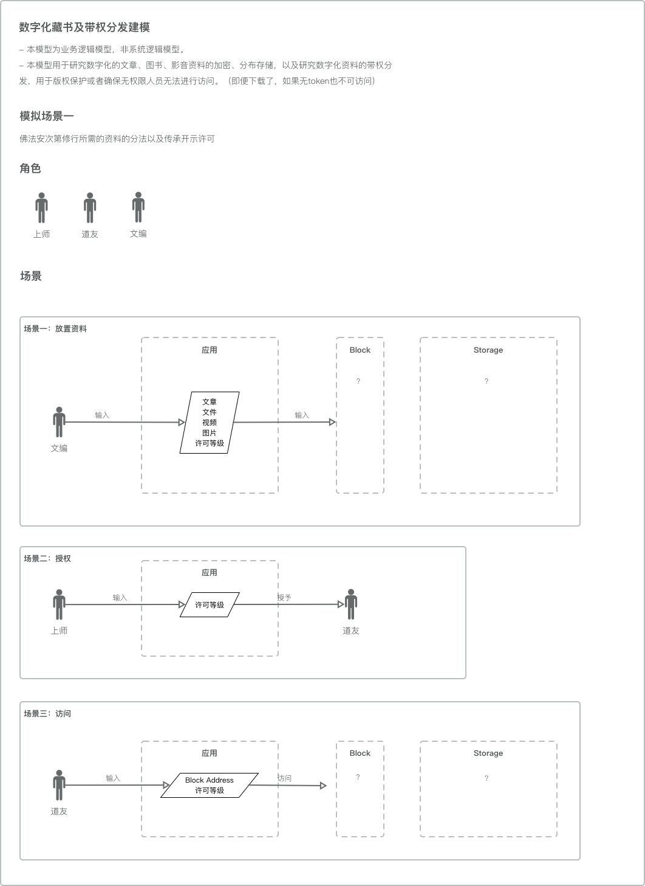

# Digital Tripitaka Library 电子藏经阁项目

------

本项目用于搭建电子版的一乘藏经阁，本项目在一乘尚未正式立项，只是前期研究项目。

缘起于上师转发的文章：<https://mp.weixin.qq.com/s/TPV8W_S8rmh4rA8I270aog> 

欢迎大家转给具有相关知识的道友，共同完成本项目标。

This project is to build a online digital tripitaka library for Ekayana Sutra and Tantra Study and Practice Institute. It can also been used by other Buddism Institute once the technology is ready for use.

This project is still undergoing in research stage and not yet an official project of Ekayana.

The reason why I built this project is from an article sent by my teach Achary ZhiGuang which is <https://mp.weixin.qq.com/s/TPV8W_S8rmh4rA8I270aog> .

If you are interested in building this project together, please feel free to contact me.

### Majar Issues 主要问题

------

1. ##### Encrypted Tripitaka storage

   In order avoid unauthorized access to the files who didn't reach the buddism level, It should be encrypted whether online or offline. The storage should also be safe in case of unexpected situation of destruction and should be kept in very long term in the history to benifit more people.

2. ##### Access control for different level of students 

   It's the same reason as issue No.1, those not yet reach the proper buddism level should not access the files above their knowledge.

3. ##### Immutability to maintain pure blood line.

   All resources taught by Archary should be sealed and can not be modiefied to maintain pure blood line. 

1. ##### 加密存储

   为了避免未达到相关学修层级的学生能够访问到相关的视频、文章，比如未完成五加行、未接受某传法灌顶，所以需要对资料进行加密存储。这个加密不仅仅涉及到线上资料的加密，还包括已下载资料也需要访问权限才能够访问获取到。另外，存储需要考虑到存储安全问题，避免未可知的原因造成资料的丢失。同时，存储需要保留尽可能久的时间，以便能够利益到后人。

2. ##### 访问权限

   同第一条，未达到某一前提条件的学生不应该私自去阅读相关的文章和观看相关视频。所以需要通过权限的控制来达到该目的。比如修过五加行的道友可以访问五加行相关的视频、经论资料。

3. ##### 防串改，确保法脉

   上师的传法是一代一代传承下来的，法脉的纯净能够确保道友所学习的是从佛陀一直到各代传承祖师所保留下来的教导。运用防串改，可以避免各类法本、仪轨、经论、咒语因为各种流通的原因而产生的偏差。

### Initial Thought 初步考虑

------

1. Knowledge pool
2. Building Product Structure
3. Contribution Machanism
4. Content Preparation

1. 建立知识架构
2. 建立产品体系
3. 设定贡献玩法
4. 完善内容

### Scenarios 场景

------

### Problems 问题

------

1. Block train have stroge limitation for each block and it's not design for big data storage. So how do we use block train to store videos, images, articles?

   区块链的每个区块可储存的内容是很少的，基本是用来存储账本信息的，那么文本、图片、视频这些资料如何存储呢？

2. After user downloaded resources like video, articles , how do we prevent them from forwarding files?

   如果是传统方式的存储视频等大文件，那么用户在下载了之后如何放置再传播呢？或者说不需要考虑这个问题？

3. My english is not good enough 